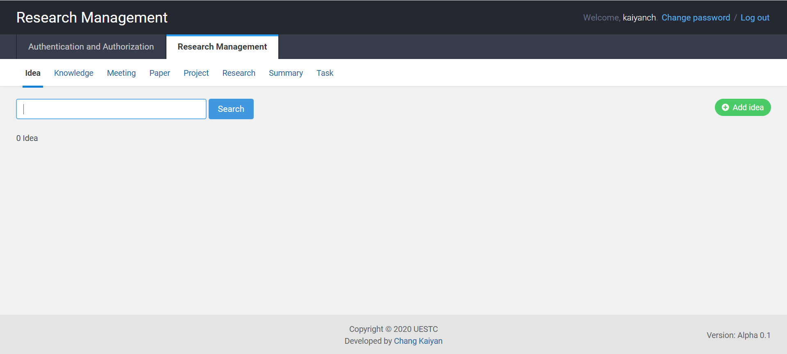

# 科研管理平台 (Research Management)

为研究人员提供一个管理科研工作的平台。可以用markdown语法写summary。考虑到研究工作者基本都是用英文，因此这个平台也用英语写的。

## 启动

平台用django写，单人使用debug模式就足够了。在根目录下打开命令行窗口。
~~~bash
pip install -r requirements.txt # 安装必要的包
python manage.py runserver 8000 # 启动服务器和sqllite数据库
~~~

然后打开浏览器，访问 http://127.0.0.1:8000/admin 就可以看到界面了。初始账户和密码均为admin。

## 数据形式

每个paper和每个project都必须属于一个research，每个task也都属于research，因此要先建立research再添加其他操作。

Have fun and star it！
有问题或者bug可以在issue中提出来。期待能够提高你的科研效率。